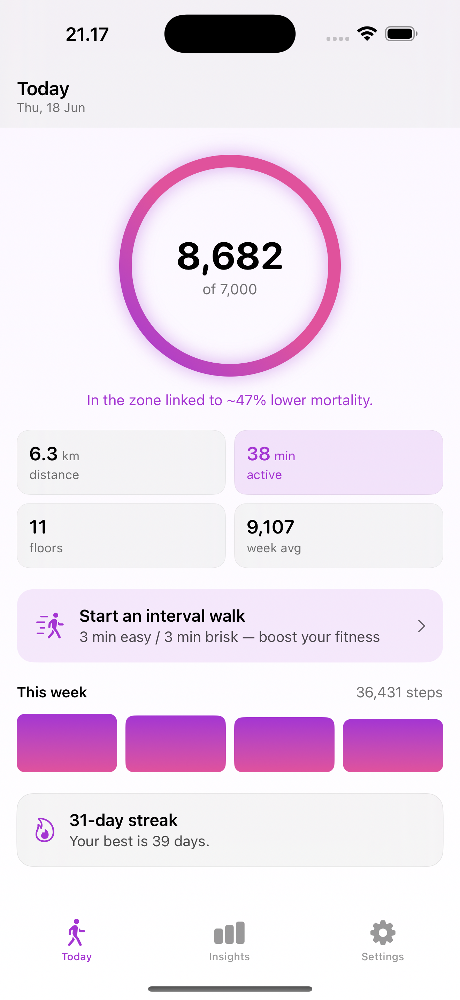
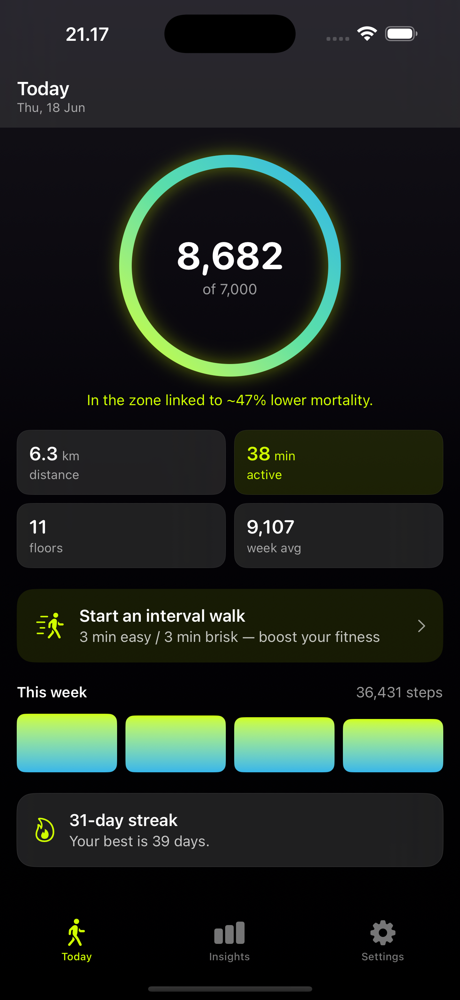
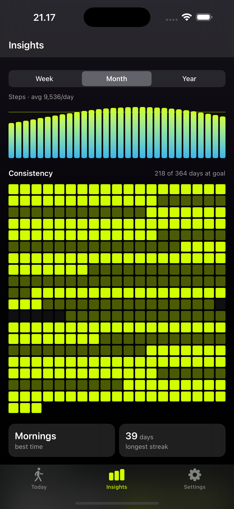

# Walkful

> Every step counts.

[](https://github.com/JarlLyng/walkful/actions/workflows/ci.yml)


[](https://apps.apple.com/app/id6781303837)


[](https://madebyhuman.iamjarl.com)

A calm, private, evidence-based **step & walking tracker for iPhone and Apple Watch**. Walkful adds a meaningful motivation layer on top of Apple Health — and keeps **everything on your device**: no accounts, no servers, no ads, no data collection.

Made by **IAMJARL** · [walkful.iamjarl.com](https://walkful.iamjarl.com)

<p align="center">
  
  
  
</p>

---

## Status

- 🎉 **Live on the [App Store](https://apps.apple.com/app/id6781303837)** — v1.0. Free app + a one-time **Walkful Pro** unlock.
- Shipped: interval-walking coach, sedentary-aware nudges, Home/Lock Screen widgets, a deep Pro **Insights** tab (week/month/year trends, year heatmap, mobility & fitness, longevity-zone card, records, monthly recap, CSV export), the **Aurora** visual design, and full **accessibility** (Dynamic Type, VoiceOver, Reduced Motion).
- 🚧 Next: Apple Watch app/complication, in-app Danish localization, ASO. See **[GitHub Issues](../../issues)** for the live backlog.

## What makes it different

- **Meaning over numbers** — progress is paired with what it means for your health, grounded in research (2025 Lancet Public Health; Bente Klarlund Pedersen), not the 10,000-steps myth.
- **Private by architecture** — all data is read from Apple Health and processed on-device. App Store privacy label: *Data Not Collected*.
- **Calm, no manipulation** — no pace-shaming, no social leaderboards, no dark patterns. You compete against your own records.

See **[RESEARCH.md](RESEARCH.md)** (market + science) and **[PRD.md](PRD.md)** (product spec) for the full rationale.

---

## Tech stack

| | |
|---|---|
| Language / UI | Swift 5 (language mode), SwiftUI |
| Min OS | iOS 18 |
| Health data | HealthKit (read-only) |
| Local storage | SwiftData |
| Notifications | UserNotifications (local only) |
| Background | BackgroundTasks (sedentary check) + App Group (widget sharing) |
| Widgets | WidgetKit (Home Screen + Lock Screen) |
| Monetization | StoreKit 2 — one-time non-consumable ("Walkful Pro") |
| Diagnostics | MetricKit (Apple-native, no third-party SDK) |
| Design system | [IAMJARLDesignTokens](https://github.com/JarlLyng/iamjarl-design) via SPM |
| Project generation | [XcodeGen](https://github.com/yonaskolb/XcodeGen) (`project.yml`) |

There is **no backend** — by design.

## Getting started

Prerequisites: **Xcode 26+** and **XcodeGen** (`brew install xcodegen`).

```bash
# 1. Generate the Xcode project (it is git-ignored — project.yml is the source of truth)
xcodegen generate

# 2. Open and run
open Walkful.xcodeproj
#    (select an iPhone simulator or device, then Run)

# …or build from the command line:
xcodebuild -project Walkful.xcodeproj -scheme Walkful \
  -destination 'generic/platform=iOS Simulator' build
```

> ℹ️ The `.xcodeproj` is **generated** and git-ignored. Never edit it by hand — change `project.yml` and re-run `xcodegen generate`. See [CONTRIBUTING.md](CONTRIBUTING.md).

## Project structure

```
walking-app/
├─ project.yml              # XcodeGen project definition (source of truth)
├─ Walkful.storekit         # Local StoreKit config (testing only)
├─ Walkful/                 # App source
│  ├─ WalkfulApp.swift      # @main, SwiftData container, MetricKit, BG task register
│  ├─ RootView.swift        # RootContainer (routing) + RootView (tabs)
│  ├─ Core/
│  │  ├─ Health/            # HealthKitService
│  │  ├─ Persistence/       # AppSettings (@Model)
│  │  ├─ Notifications/     # NudgeScheduler + SedentaryMonitor (BackgroundTasks)
│  │  ├─ Store/             # Store (StoreKit 2 — Walkful Pro)
│  │  ├─ Shared/            # SharedStore (App Group snapshot for the widget)
│  │  ├─ Diagnostics/       # MetricsSubscriber (MetricKit)
│  │  ├─ Theme/             # WalkfulTheme (IAMJARL tokens) + Components
│  │  └─ Formatters.swift
│  ├─ Features/             # Onboarding / Today / Insights / Coach / Paywall / Settings
│  └─ Resources/            # Assets.xcassets (layered app icon)
├─ WalkfulWidget/           # WidgetKit extension (Home + Lock Screen)
├─ website/                 # Marketing site (static, SEO/GEO)
├─ RESEARCH.md PRD.md TECH_PLAN.md   # Product & research docs (Danish)
└─ ARCHITECTURE.md CONTRIBUTING.md CHANGELOG.md   # Developer docs (English)
```

> Generated and git-ignored: `Walkful.xcodeproj`, `Walkful/Info.plist`, `WalkfulWidget/Info.plist`. Run `xcodegen generate` after pulling.

## Documentation

- **[ARCHITECTURE.md](ARCHITECTURE.md)** — how the code is organised and how data flows.
- **[CONTRIBUTING.md](CONTRIBUTING.md)** — setup, conventions, workflow, release.
- **[docs/ROADMAP.md](docs/ROADMAP.md)** — project status, how work is tracked, and where to start (handoff).
- **[docs/app-store-release.md](docs/app-store-release.md)** — App Store listing copy + submit checklist.
- **[docs/device-checklist.md](docs/device-checklist.md)** — what to verify on a physical iPhone/Watch (the things the simulator can't).
- **[docs/trademark-check.md](docs/trademark-check.md)** — preliminary "Walkful" trademark clearance + next steps.
- **[CHANGELOG.md](CHANGELOG.md)** — notable changes.
- **[PRD.md](PRD.md)** · **[RESEARCH.md](RESEARCH.md)** · **[TECH_PLAN.md](TECH_PLAN.md)** — product spec, market/science research, technical plan (Danish).
- **[TARGETAUDIENCE.md](TARGETAUDIENCE.md)** — who we build & sell for: ICP, personas, anti-personas, messaging, channels (English).
- **[website/](website/)** — marketing site + privacy policy.

## Privacy

Walkful collects nothing. Health data is read from Apple Health with explicit, granular permission, used only on-device, and never transmitted. See [website/privacy.html](website/privacy.html).

## License

Proprietary © 2026 IAMJARL. All rights reserved.
